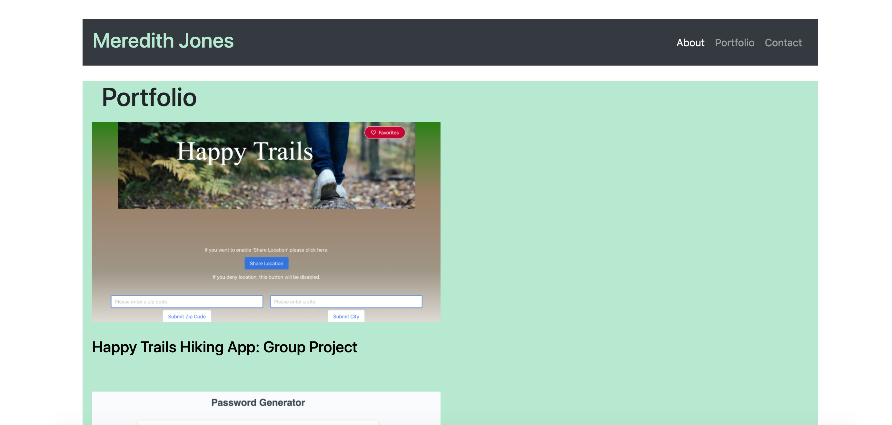
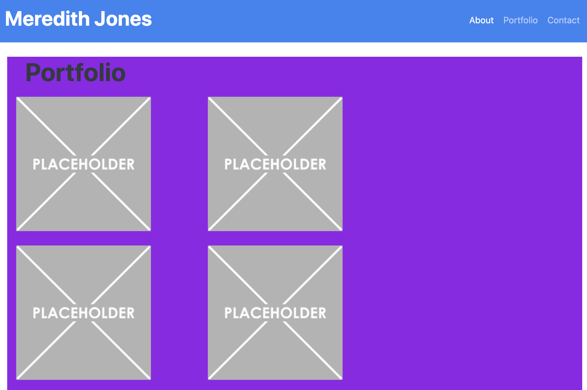

Project Name: Meredith Jones Updated Portfolio
======================================================================

* Project Description: 

For this project, I am working to update my portfolio to show potential employers some of the work that I have completed during my current coding bootcamp education. 

I have added screenshot links to my portfolio of the group project that I just completed with my team, as well as two of my projects which I believe stood out from the others in their appearance and functionality. 

I additionally updated the color scheme, and corrected some of the styling that was still somewhat rough around the edges from when I first put my portfolio together during the first weeks of the bootcamp. I have included a screenshot below of my portfolio page's current appearence, as well as the original as a point of comparison. 

Below is my original portfolio page design: 

There is still room for improvement and work to be done in order for me to have my portfolio, resume and professional profile pages where I would like them to be for my job search. The updates that I made for this project are a step in the right direction and I am looking forward to making continued improvements. 

* Technology Used: 
    -HTML
    -CSS
    -FontAwesome
    -Bootstrap 

* License 
    The MIT License (MIT)